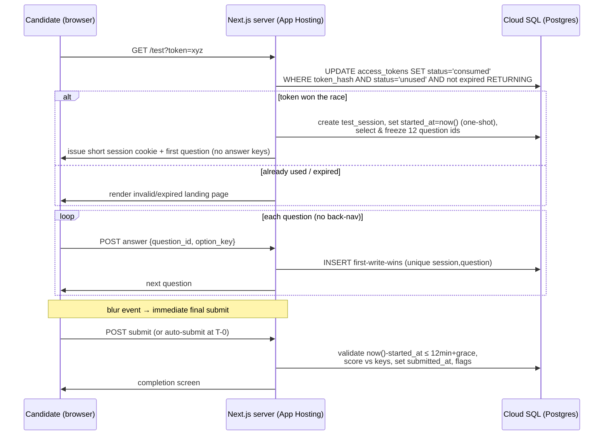
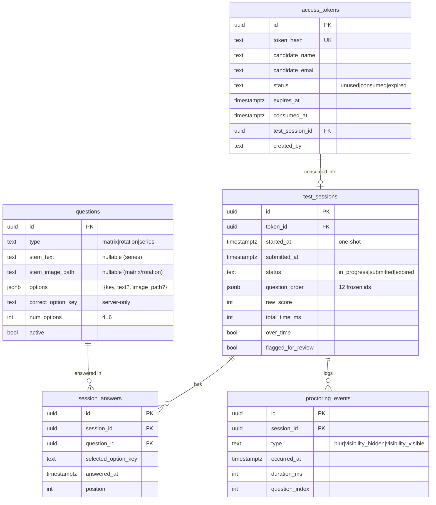

# feat: Cognitive Screening Web App (ICAR) on Firebase + Cloud SQL

## Problem Frame

We need a lightweight, secure, self-hosted web app that administers a short, time-locked
cognitive screening test to global job applicants, using public-domain ICAR (International
Cognitive Ability Resource) item formats so the test is language- and culture-neutral.

The product has two surfaces:

1. **Candidate Testing Interface** — token-gated, sequential 12-question test, one-at-a-time,
   no back-navigation, a 12-minute server-authoritative countdown, and anti-cheating guardrails
   (window-blur triggers immediate final submission).
2. **Admin Dashboard** — Firebase Auth-protected; manages the question pool, uploads visual
   assets, sets answer keys, generates single-use expiring candidate tokens, and shows an
   analytics table of results.

The central engineering risk is **test integrity**: every authoritative decision (timing,
scoring, single-use token consumption, answer locking) must live on the server in Cloud SQL,
never trusting client-supplied values. Front-end guardrails are advisory only.

---

## Scope & Confirmed Decisions

Confirmed with the user before planning:

- **Frontend/API topology:** Integrated **Next.js App Router server** (not a decoupled SPA +
  standalone Cloud Functions). API surface is Next.js Route Handlers / Server Actions, deployed
  on **Firebase App Hosting** (Cloud Run under the hood).
- **Admin authentication:** **Firebase Auth** (session cookies + `admin` custom claim),
  not a single env-var password.
- **Anti-cheat blur policy:** Window blur triggers an **immediate final submission** of the
  test (harshest interpretation, per spec), with the warning flag recorded.

### Scope Boundaries

**In scope (this product):**
- Two surfaces above, server-authoritative timing/scoring/tokens, ICAR matrix / 3D-rotation /
  letter-number-series item types, Firebase Storage asset serving, results analytics.

**Deferred to Follow-Up Work** (planned, but out of this build's first pass):
- Email delivery of invite links (admin copies generated link manually for v1).
- Item-pool rotation / randomized item banks to mitigate public-item exposure.
- Per-domain sub-score analytics and IRT-based scoring (raw X/12 only for v1).
- Bulk token generation / CSV import of candidates.

**Outside this product's identity:**
- Full remote proctoring (webcam, screen recording, identity verification).
- Adaptive testing / cross-form equating.
- Candidate self-registration or accounts (candidates are anonymous token holders).

### Assumptions
- One token maps to exactly one test session; candidates are otherwise unauthenticated.
- 12 items = **4 each** of the three ICAR types, drawn from the active pool and order-randomized.
- A small invite-link expiry window (default 7 days) is separate from the in-test 12-minute clock.
- HR/legal sign-off on using ICAR scores as a hiring gate is a **process** dependency outside
  this plan, but the app stores scores as one reviewable input, not an auto-decision.

---

## Key Technical Decisions

| Decision | Choice | Rationale |
|---|---|---|
| Deployment | Firebase **App Hosting** | 2026-current path for Next.js SSR on Firebase; old webframeworks preview is closed to new projects. Cloud Run under the hood supports all App Router server features. |
| DB access | `@google-cloud/cloud-sql-connector` + `pg`, IAM auth | Recommended Node path for Cloud Run → Cloud SQL; no long-lived password; in-process mTLS tunnel. |
| ORM / migrations | **Drizzle ORM + Drizzle Kit** | Lighter cold starts than Prisma (no query engine binary); SQL-first migrations; composes directly with `pg.Pool`. |
| Token model | Opaque 256-bit CSPRNG, stored as `sha256` hash | Single-use/revocation is native to opaque tokens; no payload leakage; short URLs. |
| Single-use enforcement | Atomic conditional `UPDATE ... WHERE status='unused' AND expires_at>now() RETURNING` | One statement wins the two-tab race under READ COMMITTED; no SELECT-then-UPDATE anomaly. |
| Timer authority | Server one-shot `started_at`; deadline = start + 12min; validate on submit | Both endpoints are server time → client clock skew is irrelevant. |
| Answer persistence | Per-answer, append-only / first-write-wins per `(session, question)` | Enforces no-back-nav lock server-side; crash/timeout insurance. |
| Abandoned sessions | Scheduled **sweep finalizer** (Cloud Scheduler → Route Handler) | Finalizes sessions where `started_at + 12min + grace < now()` still open. |
| Admin auth | Firebase session cookies + `admin` custom claim | httpOnly/secure, revocable, role check is a pure JWT claim (no DB round-trip). |
| Asset upload | Server-side via Admin SDK after admin verification | Keeps write rules closed; validation server-side; uses runtime SA. |
| Firestore | Optional — config flags / rate-limit counters only | Postgres is system of record for tokens/sessions; research advises against cache-as-truth for single-use. |

---

## High-Level Technical Design

*This illustrates the intended approach and is directional guidance for review, not
implementation specification. The implementing agent should treat it as context, not code.*

### Candidate flow (server-authoritative)



### Data model



---

## Output Structure

```text
.
├── apphosting.yaml                 # App Hosting runConfig, env, secrets, VPC egress
├── firebase.json                   # Firebase project config
├── storage.rules                   # deny client reads/writes; server-side only
├── drizzle.config.ts
├── next.config.ts
├── package.json
├── src/
│   ├── app/
│   │   ├── test/                   # candidate surface
│   │   │   ├── page.tsx            # token landing + test shell
│   │   │   └── components/         # QuestionRenderer, Timer, MatrixItem, RotationItem, SeriesItem
│   │   ├── admin/                  # admin surface (auth-gated)
│   │   │   ├── login/page.tsx
│   │   │   ├── questions/page.tsx
│   │   │   ├── tokens/page.tsx
│   │   │   └── results/page.tsx
│   │   └── api/
│   │       ├── session/            # init, answer, submit route handlers
│   │       ├── session/route.ts    # Firebase session-cookie mint/clear
│   │       ├── proctoring/route.ts
│   │       ├── admin/...           # question CRUD, asset upload, token gen, results
│   │       └── cron/sweep/route.ts # scheduled finalizer
│   ├── proxy.ts                    # (Next 16) or middleware.ts (Next 15) — admin gating
│   ├── db/
│   │   ├── client.ts               # cloud-sql-connector + pg.Pool (module scope)
│   │   ├── schema.ts               # Drizzle schema
│   │   └── migrations/
│   ├── lib/
│   │   ├── firebase-admin.ts       # Admin SDK init
│   │   ├── firebase-client.ts
│   │   ├── auth.ts                 # session-cookie verify + admin claim guard
│   │   ├── tokens.ts               # generate/hash/consume
│   │   ├── scoring.ts              # server-side scoring
│   │   ├── timer.ts                # elapsed/deadline/grace logic
│   │   └── question-select.ts      # 4×3 selection + order randomization
│   └── types/
└── docs/plans/
```

---

## Implementation Units

Grouped into three phases. U-IDs are stable.

### Phase A — Foundation

### U1. Project scaffold, Tailwind, and App Hosting deployment config

**Goal:** Stand up a Next.js (App Router) + TypeScript + Tailwind project that deploys on
Firebase App Hosting, with secrets/env wired.

**Requirements:** Technical stack constraints (Next.js App Router, Tailwind, TS, Firebase Hosting).

**Dependencies:** none.

**Files:**
- `package.json`, `next.config.ts`, `tsconfig.json`, `tailwind.config.ts`, `postcss.config.mjs`
- `apphosting.yaml`, `firebase.json`, `.firebaserc`
- `src/app/layout.tsx`, `src/app/globals.css`
- `.env.example`

**Approach:** Latest stable Next.js (15/16), Node 22+. `apphosting.yaml` sets `runConfig`
(small CPU/mem, `minInstances: 1` to avoid cold-start DB latency on admin), env vars, and
references Cloud Secret Manager for `DB_*` and Firebase service-account material. Reuse the
visual language from `matrix-reasoning-example.html` (CSS variables, card/timer-bar styling) as
the Tailwind theme baseline. Note Next.js 16 renames `middleware.ts` → `proxy.ts` (Node runtime).

**Patterns to follow:** `matrix-reasoning-example.html` for color tokens and component look.

**Test expectation:** none — scaffolding/config. Verification: `next build` succeeds locally and
a deploy preview boots on App Hosting serving the placeholder layout.

**Verification:** App builds; App Hosting preview URL renders the base layout; env/secret
references resolve at runtime.

---

### U2. Database client, Drizzle schema, and migrations

**Goal:** Define the full schema and a working, securely-pooled Cloud SQL connection.

**Requirements:** Cloud SQL (Postgres) as system of record for analytics/transactional data.

**Dependencies:** U1.

**Files:**
- `src/db/client.ts` (cloud-sql-connector + `pg.Pool`, module scope)
- `src/db/schema.ts` (questions, access_tokens, test_sessions, session_answers, proctoring_events)
- `drizzle.config.ts`, `src/db/migrations/*`
- `src/db/client.test.ts`

**Approach:** `@google-cloud/cloud-sql-connector` with `authType: 'IAM'`, `ipType: 'PRIVATE'`,
SA user, `pg.Pool` with small `max` (2–5), created once at module scope. Drizzle schema per the
ERD; enums for `type`/`status`; `unique(session_id, question_id)` on `session_answers` to enforce
first-write-wins; `correct_option_key` lives only here and is never selected into client payloads.
Migrations run as a **CI/CD step**, never at runtime/boot.

**Patterns to follow:** module-scoped singleton pool; `now()` set in SQL, never client-supplied.

**Test scenarios:**
- Schema migration applies cleanly to a fresh Postgres (integration, e.g. Testcontainers/local PG).
- `session_answers` unique constraint rejects a second insert for the same `(session, question)`.
- Pool is a singleton — repeated `getDb()` calls return the same pool instance.
- Connector config selects IAM auth path when env indicates IAM (no password in connection opts).

**Verification:** Migrations produce the ERD tables; constraints enforced; app connects to Cloud
SQL from an App Hosting preview.

---

### U3. Firebase Auth admin gating

**Goal:** Admin-only access via Firebase Auth session cookies and an `admin` custom claim, gated
server-side.

**Requirements:** Admin Dashboard security.

**Dependencies:** U1.

**Files:**
- `src/lib/firebase-admin.ts`, `src/lib/firebase-client.ts`, `src/lib/auth.ts`
- `src/app/api/session/route.ts` (mint/clear session cookie from ID token)
- `src/app/admin/login/page.tsx`
- `src/proxy.ts` (or `src/middleware.ts`)
- `src/lib/auth.test.ts`

**Approach:** Client signs in (Firebase client SDK) → POSTs ID token → server
`createSessionCookie` (httpOnly/secure) → store. Gate `/admin/**` in proxy/middleware **and**
re-verify in each admin Route Handler/Server Action (`verifySessionCookie(cookie, true)` +
`decoded.admin`). Admin claim is set via a one-off trusted script (documented in `.env.example`/
README). Consider `next-firebase-auth-edge` with `enableMultipleCookies` if claim size matters.

**Patterns to follow:** defense-in-depth — middleware is not the only boundary; re-check in handlers.

**Test scenarios:**
- Valid session cookie with `admin: true` → handler returns 200.
- Valid cookie without `admin` claim → 403.
- Missing/expired/revoked cookie → redirect to `/admin/login` (or 401 for API).
- `createSessionCookie` rejects an invalid ID token.
- Revoked user (`checkRevoked`) is denied even with a non-expired cookie.

**Verification:** Unauthenticated/non-admin users cannot reach any `/admin` route or admin API.

---

### Phase B — Core test engine (server-authoritative)

### U4. Access token lifecycle (generate + atomic consume)

**Goal:** Generate single-use, time-expiring tokens and consume them race-safely.

**Requirements:** Token validated against DB before launch; single-use, time-expiring tokens.

**Dependencies:** U2, U3.

**Files:**
- `src/lib/tokens.ts` (generate, hash, consume)
- `src/app/api/admin/tokens/route.ts` (admin-only generation)
- `src/lib/tokens.test.ts`

**Approach:** Generate `crypto.randomBytes(32)` → base64url; return raw token once (for the link),
store `sha256(token)` only. Consume via the single atomic statement:
`UPDATE access_tokens SET status='consumed', consumed_at=now() WHERE token_hash=$1 AND
status='unused' AND expires_at>now() RETURNING id`. Zero rows → invalid/expired/used.
Token generation is an admin-gated handler (uses U3 guard). Invite expiry (`expires_at`) is
separate from the in-test clock.

**Execution note:** Implement the consume path test-first — the race semantics are the core
correctness guarantee.

**Patterns to follow:** store hashes not secrets; single-statement conditional update.

**Test scenarios:**
- Generate returns raw token once; only the hash is persisted.
- Consume on `unused` non-expired token → success, status flips to `consumed`.
- Two concurrent consumes of the same token → exactly one succeeds, the other gets zero rows.
- Consume on already-`consumed` token → rejected.
- Consume on expired token (`expires_at < now()`) → rejected even if `unused`.
- Token lookup uses the hash, never the raw value.
- Token generation endpoint rejects non-admin callers (integration with U3).

**Verification:** A token works exactly once; expired/used tokens are refused; no double-consume
under concurrency.

---

### U5. Test session lifecycle API (init, question delivery, per-answer persistence)

**Goal:** Initialize a session on token consumption with a one-shot `started_at`, freeze a
randomized 12-question set, serve questions one-at-a-time without answer keys, and persist each
answer first-write-wins.

**Requirements:** Token-gated launch; sequential one-at-a-time layout; no back-navigation;
server-written start time; image/text item delivery.

**Dependencies:** U4, U2.

**Files:**
- `src/lib/question-select.ts` (4 × 3 types, order-randomized)
- `src/app/api/session/init/route.ts`
- `src/app/api/session/answer/route.ts`
- `src/app/api/session/state/route.ts` (resume/current question)
- `src/lib/question-select.test.ts`, plus route handler tests

**Approach:** `init` consumes the token (U4) in the same transaction that creates the
`test_session`, sets `started_at = now()` **only if NULL** (one-shot), and freezes
`question_order` (12 ids = 4 each type from active pool, shuffled). Issue a short server session
cookie for in-test calls; the invite token is burned. Question payloads strip `correct_option_key`.
`answer` validates the question belongs to the session and is the expected next item, then inserts
append-only; a duplicate `(session, question)` is rejected (the no-back-nav lock). On reload,
`state` reads back the existing `started_at` and resumes at the next unanswered item.

**Execution note:** Start with a failing integration test for init → answer → state contract.

**Patterns to follow:** one-shot `started_at`; keys never serialized to client; first-write-wins.

**Test scenarios:**
- `init` with a valid token creates a session, sets `started_at` once, freezes 12 ids (4/4/4).
- `init` twice (reload) does **not** reset `started_at`; returns existing session/state.
- `init` with an invalid/used token → rejected (no session created).
- Question payload contains options but **never** `correct_option_key`.
- `answer` for the current question persists and advances.
- Second `answer` to an already-answered question → rejected (lock enforced).
- `answer` for a question not in this session's frozen order → rejected.
- `answer` after the session is `submitted`/`expired` → rejected.
- `question-select` returns exactly 4 of each of the three types when pool is sufficient; errors/
  signals clearly when the active pool is too small.

**Verification:** A candidate can run start→answer→next without ever being able to alter a prior
answer or reset the clock; keys never leave the server.

---

### U6. Submission, server scoring, timer enforcement, and sweep finalizer

**Goal:** Finalize a session with server-validated timing and scoring, and auto-finalize
abandoned sessions.

**Requirements:** Server-validated completion time; auto-submit at zero; raw score X/12 computed
on server; total time calculated server-side.

**Dependencies:** U5.

**Files:**
- `src/lib/scoring.ts`, `src/lib/timer.ts`
- `src/app/api/session/submit/route.ts`
- `src/app/api/cron/sweep/route.ts` (Cloud Scheduler-triggered)
- `src/lib/scoring.test.ts`, `src/lib/timer.test.ts`, submit handler test

**Approach:** `submit` computes `elapsed = now() - started_at`; if `elapsed ≤ 12min + grace`
(grace 5–15s) accept; if beyond grace, accept-but-flag (`over_time=true`) rather than hard-reject.
Score = count of `session_answers` matching `correct_option_key`; set `raw_score`,
`total_time_ms`, `submitted_at`, `status='submitted'`. Submit is one-shot (idempotent: a second
submit returns the finalized result, does not rescore). The sweep handler finds
`status='in_progress' AND started_at + 12min + grace < now()`, scores whatever was persisted,
sets `status='expired'`, and flags. Sweep endpoint is protected (Scheduler OIDC / shared secret).

**Execution note:** Scoring and timer are pure functions — implement test-first.

**Patterns to follow:** never trust client time; grace window; accept-but-flag overruns;
idempotent finalize.

**Test scenarios:**
- Score counts correct answers vs keys; unanswered questions count as wrong → `X/12`.
- All correct → 12/12; none correct → 0/12; partial → exact count.
- Submit within limit → `over_time=false`; within grace → accepted, `over_time=false`.
- Submit beyond `limit+grace` → accepted but `over_time=true` (not rejected).
- `total_time_ms` derived from `now()-started_at`, ignoring any client-supplied duration.
- Double submit is idempotent — second call returns same score, does not rescore.
- Sweep finalizes an in-progress session past `limit+grace`; scores persisted answers; sets
  `expired`.
- Sweep ignores sessions still within the window and already-submitted sessions.
- Sweep endpoint rejects unauthenticated callers.

**Verification:** Final score and time are always server-computed; abandoned/closed-browser
sessions still get finalized; overruns are flagged not silently trusted.

---

### U7. Proctoring events and blur flag aggregation

**Goal:** Record tab-away/blur events and surface a reviewable `flagged_for_review` flag; support
the immediate-submit-on-blur behavior server-side.

**Requirements:** Anti-cheating guardrails; blur warning flag in analytics.

**Dependencies:** U5, U6.

**Files:**
- `src/app/api/proctoring/route.ts`
- aggregation helper in `src/lib/scoring.ts` or `src/lib/proctoring.ts`
- `src/lib/proctoring.test.ts`

**Approach:** Append `{type, occurred_at, duration_ms, question_index}` to `proctoring_events`.
Since the confirmed policy is **immediate final submission on blur**, the client's blur handler
calls `submit` (U6); this unit records the proctoring event and ensures the session's
`flagged_for_review` is set when any blur/`visibility_hidden` event exists. `visibilitychange`
returns are logged for away-duration. Server is the aggregator; client counts are advisory.

**Patterns to follow:** advisory-only client signals; aggregate to a single reviewer-facing flag;
absence of events is not proof of honesty.

**Test scenarios:**
- A blur event for a session sets `flagged_for_review=true`.
- Multiple events aggregate (count/total away time) without duplicating the flag.
- Proctoring write requires a valid in-test session (rejects unknown/foreign session ids).
- Event recorded for an already-submitted session is stored but does not alter the score.

**Verification:** Any blur/tab-away is recorded and reflected as a flag the recruiter can see.

---

### Phase C — Interfaces

### U8. Candidate testing UI (ICAR renderers, timer, no-back, blur submit)

**Goal:** The candidate-facing test experience: token landing, sequential question rendering for
all three ICAR types, a synchronized countdown, no back-navigation, auto-submit at zero, and
immediate submit on blur.

**Requirements:** Candidate Testing Interface (all sub-requirements); dual-layered time limits;
anti-cheating blur behavior.

**Dependencies:** U5, U6, U7.

**Files:**
- `src/app/test/page.tsx`
- `src/app/test/components/QuestionRenderer.tsx`, `Timer.tsx`, `MatrixItem.tsx`,
  `RotationItem.tsx`, `SeriesItem.tsx`, `CompletionScreen.tsx`, `InvalidTokenScreen.tsx`
- component tests under `src/app/test/components/__tests__/`

**Approach:** On load, call `init`; render server `started_at`-derived deadline so reload loses
elapsed time (never resets). Render one question at a time with 4–6 radio options; matrix/rotation
items load images from Firebase Storage (signed URL or rule-gated read), series items render text.
"Next" posts the answer and advances — no Back control. Timer counts to the server deadline; at
zero, auto-submit. A `blur` listener triggers immediate `submit` (confirmed policy);
`visibilitychange` also posts a proctoring event. Reuse the visual design from
`matrix-reasoning-example.html` (timer bar, progress, option cards, SVG shape builder for matrix
items). Handle invalid/expired/used token with a dedicated landing screen.

**Patterns to follow:** `matrix-reasoning-example.html` layout/SVG builder; deadline-anchored
timer (not interval-accumulated, which throttles in hidden tabs).

**Test scenarios:**
- Valid token renders question 1 of 12 with progress + countdown.
- Invalid/used/expired token renders the invalid-token screen, no question shown.
- Each ICAR type renders correctly: matrix (3×3 grid + options), rotation (image options),
  series (text stem + options).
- Selecting an option and clicking Next advances and disables return to the prior item.
- No Back control is present/operable.
- Timer reaching zero triggers auto-submit.
- Window blur triggers immediate submit (calls submit endpoint once).
- Reload mid-test resumes at the next unanswered question with reduced time, not a reset clock.
- Completion screen shown after submit; no score keys exposed in network payloads.

**Verification:** A candidate completes a full 12-item run; cannot go back; timer and blur behave
as specified; assets load securely.

---

### U9. Admin — question pool management + asset upload

**Goal:** Admin CRUD for the question pool, including uploading visual assets to Firebase Storage
and setting answer keys.

**Requirements:** Test Management — manage question pool, upload assets, set answer keys.

**Dependencies:** U3, U2.

**Files:**
- `src/app/admin/questions/page.tsx` + form components
- `src/app/api/admin/questions/route.ts` (list/create/update/deactivate)
- `src/app/api/admin/assets/route.ts` (server-side Storage upload)
- `storage.rules`
- handler tests under `src/app/api/admin/__tests__/`

**Approach:** Admin-gated (U3) CRUD on `questions`. Asset upload goes **server-side** via Admin
SDK (`bucket.file(path).save`), validating content type/size; `storage.rules` denies client
read/write so assets are only served through the app (signed URL or server-mediated). Form
supports the three types: matrix/rotation reference uploaded image paths for stem/options; series
uses text; admin sets `correct_option_key` and `num_options` (4–6). Soft-deactivate via `active`
flag rather than hard delete (preserves historical sessions referencing the question).

**Patterns to follow:** server-side upload after auth; closed Storage rules; soft-deactivate.

**Test scenarios:**
- Create question of each type persists with key + options; appears in active pool.
- Upload accepts allowed image types/sizes; rejects others.
- Non-admin cannot create/update/upload (integration with U3).
- Deactivating a question removes it from candidate selection but keeps it referencible by past
  sessions.
- `correct_option_key` must match one of the provided option keys (validation).

**Verification:** Admin can build a pool large enough for selection (≥4 per type), upload assets,
and set keys; assets are not publicly listable.

---

### U10. Admin — token generation UI + analytics table

**Goal:** Admin UI to generate candidate tokens and view the results analytics table.

**Requirements:** Generate single-use expiring tokens; analytics table (Name, Email, Test Date,
Raw Score X/12, server-calculated total time, blur warning flag).

**Dependencies:** U4, U6, U7, U3.

**Files:**
- `src/app/admin/tokens/page.tsx`, `src/app/admin/results/page.tsx`
- `src/app/api/admin/results/route.ts`
- handler/page tests

**Approach:** Token page collects candidate name/email + expiry, calls the U4 generation endpoint,
and displays the one-time invite link (`/test?token=...`) for the admin to copy (email delivery is
deferred). Results page queries finalized sessions and renders the analytics table: Candidate
Name, Email, Test Date (`submitted_at`/`created_at`), Raw Score (`raw_score`/12), Total Time
(server `total_time_ms`), and the `flagged_for_review`/`over_time` indicators. Read-only,
admin-gated, sortable by date/score.

**Patterns to follow:** all displayed metrics come from server-computed columns, never recomputed
client-side.

**Test scenarios:**
- Generating a token displays the invite link exactly once and lists the pending token.
- Results table shows finalized sessions with correct score, server time, and flag columns.
- In-progress (not yet finalized) sessions are distinguishable from completed ones.
- Blur-flagged sessions show the warning indicator; over-time sessions show the over-time flag.
- Non-admin cannot view tokens or results (integration with U3).

**Verification:** Admin can issue a working invite link and review accurate, server-sourced results
including integrity flags.

---

## System-Wide Impact

- **Security surface:** token consumption, admin auth, and Storage rules are the highest-risk
  seams — each is gated server-side and covered by tests above.
- **Operations:** requires a Cloud Scheduler job hitting `/api/cron/sweep`, a Cloud SQL instance
  with IAM auth + the App Hosting SA granted `cloudsql.client` + `cloudsql.instanceUser`, VPC
  egress config, and Secret Manager entries. Migrations run as a CI/CD step.
- **Affected parties:** candidates (UX of a hard, timed, no-back test), recruiters/admins
  (pool curation + review), and HR/legal (validity/fairness sign-off before using scores as a gate).

---

## Risk Analysis & Mitigation

| Risk | Mitigation |
|---|---|
| Client tampering with timer/score | All authority server-side; keys never sent; elapsed from server `started_at`. |
| Two-tab / replay token abuse | Atomic single-use consume; session decoupled from invite token. |
| Browser closed before submit | Per-answer persistence + scheduled sweep finalizer. |
| Blur false positives (mobile, notifications) | Flag for review, not auto-fail; record duration; immediate-submit policy is the user's explicit choice and is surfaced as a flag. |
| Public ICAR item exposure | Out of v1 scope to fully solve; deferred item-rotation noted; anti-cheat flags partially mitigate. |
| Cloud Run connection exhaustion | Small module-scoped pool; `maxInstances * pool.max < max_connections`. |
| Legal/fairness of cognitive screening | Process dependency flagged; app stores scores as reviewable input, not auto-decision. |

---

## Dependencies / Prerequisites

- GCP project with Cloud SQL (Postgres) instance, IAM auth enabled, Cloud SQL Admin API on.
- Firebase project on App Hosting; Firebase Auth + Storage enabled; Secret Manager populated.
- App Hosting service account granted Cloud SQL + Storage roles; VPC egress configured.
- Cloud Scheduler configured to invoke the sweep endpoint.
- A seeded question pool (≥4 active items per ICAR type) before any candidate can be tested (U9 → U5).

---

## Open Questions (deferred to implementation)

- Exact grace-window length (5–15s) — tune against observed latency.
- Whether to serve assets via short-lived signed URLs vs. rule-gated reads — decide during U8/U9.
- Next.js version pin (15 vs 16) and the `middleware.ts`/`proxy.ts` split — confirm against the
  current App Hosting framework support schedule at scaffold time (U1).
